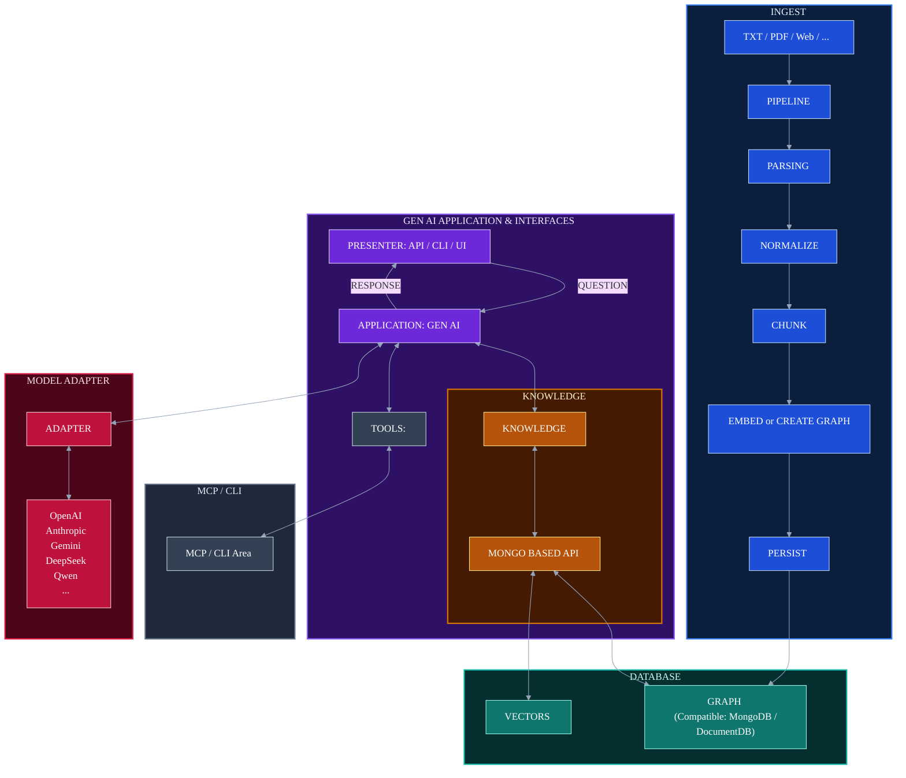

# Milona — GenAI Application Architecture

### A model-agnostic pipeline for ingesting, storing, and reasoning over knowledge

Milona ingests documents from multiple sources, normalizes and chunks them, then persists
the result as both a knowledge graph and vector embeddings on a MongoDB-compatible store.
A GenAI application layer sits on top, exposed through an API/CLI/UI presenter, querying
that knowledge via a dedicated API, invoking external tools through MCP/CLI, and routing
inference through a swappable adapter that supports OpenAI, Anthropic, Gemini, DeepSeek,
Qwen, and other LLM providers.

## Diagram
